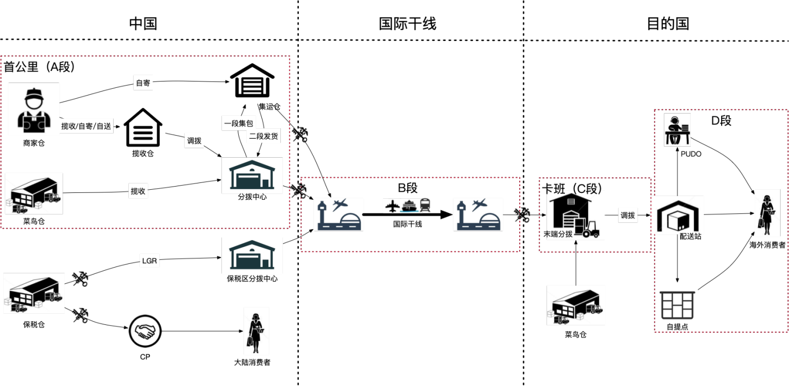
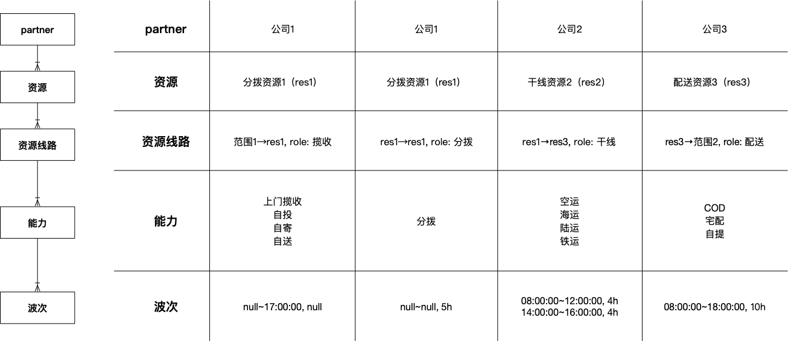

物流网络探讨一：如何建模
======
> 骥禹

# 引言
进入这个专题，很多读者可能认为笔者要介绍DDD或者TOGAF之类的方法论，其实不然。
在实际工作过程中，笔者参加的争论，很少关乎复杂逻辑，更多的是一些基础的问题，而这正是笔者想要介绍的。

既然要介绍**建模**，有一个概念一定绕不开，那就是**架构**。**什么是架构**？简言之，**架构就是对象及其关系**。
我们**探索对象及其关系的过程，就是建模**。

# 业务简介
笔者接触的业务，主要有两种类型。一种是**商家备货到仓的过程**，大家习惯叫做**inbound**。
另一种是**包裹出库到消费者的过程**，大家习惯叫做**outbound**。

## inbound
inbound过程如下图。沿着箭头方向读图，读者可以**基本了解inbound业务**，这对于阅读本文应该足够了。
如果要详细描述，估计得洋洋洒洒几千言，暂且略过。

## outbound
outbound过程如下图。沿着箭头方向读图，读者可以**基本了解outbound业务**，这对于阅读本文应该足够了。
如果要详细描述，同样也是洋洋洒洒数千言，权且略过。

# 建模的粒度
## 粒度演变
2016年，**B段的业务**由**干线**统包。
**中国出口需要清关**，由干线统包掉，XX付钱；**目的国进口需要清关**，由干线统包掉，XX付钱。
这个时候，B段在线路上只有一个**干线节点**，我们**在统包CP（CN partner）粒度建模**。

2019年，XX为了**提升时效**，开始**在目的国采用商业清关，B段的部分线路变成统包干线加目的国进口清关**。
中国出口需要清关，继续由干线统包，XX付钱。这个时候，B段在线路上有两个节点，**干线+进口清关**。
除了统包CP，我们还**在CP粒度建模**。统包CP其实也是一家CP，统包CP粒度也可以归为CP粒度。

2020年，XX为了进一步提升时效，开始**在中国的口岸采用线上清关，且开始做B段的精细化运营**。
在中国的口岸线上清关，用前面的建模粒度，B段在线路上有三个节点，**出口清关+干线+进口清关**。
B段做精细化运营，它的路径如下图灰色框部分。

**运营的诉求是，把这些物流要素刻画出来，然后做SLA考核。** 那么问题来了。
（1）这些物流要素要不要在线路上体现出来？
（2）如果体现出来，线路将变得极其复杂，如何维护？
（3）如果不体现出来，如何考核各部分的SLA？
因为第2个问题，线路极其复杂无法维护，我们选择只体现**干线仓+出口关+干线+进口关**。
干线仓和干线，属于同一家CP，我们的**建模粒度进入CP内部**了。

这个时候，质疑声随之而来，到底在哪个粒度建模？当出现一个新场景的时候，我们如何判断是否应该在线路中体现出来？

大家都知道，提问题是不收费的，而且提了问题笔者就得回答。
在系统地思考之前，我尝试这样回答：参考英国的判例法，根据过去几年的经验来判断。大家不买账。

## 如何确定粒度
粒度太粗了会怎样？不能支持业务发展嘛。假如只在CP粒度建模，如何支持XX自建物流设施的场景？如何做各段的时效SLA考核？

粒度太细了会怎样？维护困难，直到崩溃。例如，现在首公里加一个揽收仓，最多可能生成2.2万条线路，这维护工作让运营同学望而却步。
经过一年时间的积累，28%的首公里线路与实操不匹配，开始在一些项目中拖后腿了。
如果无节制地细化下去，线路会越来越多，维护越来越困难，最后崩溃。

太粗了不行，太细了也不行，那如何确定粒度呢？

这个时候，我们应该回到我们**组网的初衷**。我们组网，有两个使用场景。
**第一个场景，将线路、能力和波次给表达使用；第二个场景，将线路、能力和波次给路由使用。**
在这两个场景中使用的信息，应该加入线路；否则不应该加入线路。
例如，精细化运营需要的物流要素，干线仓、出口关、干线和进口关加入线路，调拨、关区、货栈不应该加入线路，而是按照轨迹另外建模。

表达和路由需要，应该加入线路。
回到粒度一词，我们既不是CP粒度一刀切，也不是物流要素粒度一刀切，而是**恰当地选用CP粒度和物流要素粒度**。

# 建模出对象
## 物流要素
在inbound业务和outbound业务中，我们会接触到这些**物流设施：投递点，备货仓，保税仓，揽收仓，分拨中心，集运仓，运输，出口关，进口关，站点，PUDO，自提柜等**。
**物流设施，等同于物流要素吗？**

为了说清楚这个概念，我们来看看揽收的例子。

case 1：有一个仓库，取名叫**燕文义乌揽收仓**，它会**派面包车出去沿固定路线揽收包裹，完成揽收后对包裹做初分（分拨），然后分别送到杭州分拨中心和东莞分拨中心**。

case 2：有一个仓库，取名叫**XX东莞分拨中心**，它会**派面包车出去沿固定路线揽收包裹，完成揽收后对包裹按渠道分拣（分拨），然后交接给干线**。

我们简单对比下两个case，如下表。case 1和case 2，它们都有仓库，都做揽收，都做分拨，除了名字取得不一样，其它的看起来基本一样。

|  | case 1 | case 2 |
| ------ | ------ | ------ |
| 设施名字 | 燕文义务揽收仓 | XX东莞分拨中心 |
| 有仓库 | 有 | 有 |
| 揽收业务 | 做 | 做 |
| 分拨业务 | 做，初分 | 做，细分 |

这如何是好？

在笔者接触到的团队中，有一些人是按仓库建模的，而且这种建模思路还很有市场。
他们认为，软件的使用方是仓库人员，他们需要什么feature就加什么feature，应该按照仓库建模。
例如，上面的case 1和case 2，对两个设施分别建模并定制软件，可以很好地支持业务。
而且，他们还有强有力的佐证：燕文的几十个揽收仓都是这样作业的，揽收仓软件可以复用；
所有的分拨中心都是这样作业的，分拨中心软件可以复用。
站在可以支持业务的角度，笔者说不过他们，因为大家都可以支持好业务。

笔者的一贯主张是，**按照做了什么建模**。例如，**一个包裹的生命周期是揽收-分拨-配送**，那么我们就要刻画揽收。
至于揽收是case 1那样有独立的揽收仓，还是case 2那样由分拨中心支持，不重要，我们只关心揽收业务本身。

写了那么多，笔者自己都快糊涂了。整理下思绪，**按仓库建模适用于实操系统，按做了什么建模适用于履行系统**。
我们探讨的物流网络，这个属于履行领域，当采用按做了什么建模。

回到**物流设施和物流要素的关系**。我们采用的是按做了什么建模，那物流设施就不等同于物流要素了。
在笔者接触的业务中，沉淀了11个物流要素：备货仓，揽收，分拨，集运，关务，干线，配送，自提，调拨，中转，退货仓。
相信在之后的工作中，会有新的物流要素加入清单。

## 五个对象
物流要素这么多，它们的属性更多，如果挨个建模，那会相当麻烦。对于网络来说，可以适当地抽象，以简化问题。

第一个概念，_CP_。CP是CN partner。如果读者不是XX的同学，请忽略XX字样，直接读成partner。

第二个概念，_资源_。我们**把物流要素抽象成资源**，把11种物流要素抽象成资源的11种类型。这11种类型，我们习惯叫做*角色*。
通过这个抽象，把11个模型简化成1个模型。笔者在工作过程中，就“什么是资源”问题，跟人有过激烈的争论。
第1个分歧点：对方认为，CP提供的物流设施和线路，都是资源；笔者认为，资源是稳定少变跨应用共享的，因此物流设施是资源，线路不是资源。
第2个分歧点：对方认为，只有实实在在的仓库，才是资源；笔者认为，按做了什么建模，只要可以提供物流服务，就是资源，例如清关资源。

第三个概念，_资源线路_。**备货仓是一个点，干线是一条线，配送是一个范围**，估计很多读者会采用**点线面的方式建模**。
不过，读者采用了不同的方式，一律抽象成一条线。例如，备货仓，它的出发地=目的地=location。
例如，配送，它的出发地=location，目的地=范围。每种物流要素的抽象细节如下表。
为什么要选择按线抽象？为了简单。

|  | 按线抽象 | 按点线面抽象 |
| ------ | ------ | ------ |
| 备货仓 | from = to = location | 点，location |
| 揽收 | from = 揽收范围，to = 分拨中心的location | 面，揽收范围 |
| 分拨 | from = to = location | 点，location |
| 关务 | from = to = location | 点，location |
| 干线 | from = 出发地，to = 目的地 | 线，from = 出发地，to = 目的地 |
| 中转 | from = to = location | 点，location |
| 配送 | from = 注入地，to = 目的地 | 面，覆盖范围 |
| 自提 | from = to = location | 点，location |

第四个概念，_能力_。一条资源线路，CP能做什么，用能力来表示。2018年的时候，我们针对能力的定义进行了大量的讨论，过程非常艰辛。
结论很简单，**能力是对CP能做什么不能做什么的描述**。对读者来说，通过看枚举值列表有助于理解，如下表。

| 行业 | 能力类型 | 能力 | 打底能力 |
| ------ | ------ | ------ | ------ |
| 中小件 | 品类能力类型 | 普货、带电、化妆品、贵品等 | 普货 |
| 中小件 | 支付方式能力类型 | 普通支付、COD | 普通支付 |
| 中小件 | 揽收方式能力类型 | 上门揽收、自送、自寄 | 上门揽收 |
| 中小件 | 末端配送方式能力类型 | 宅配、自提 | 宅配 |
| 中小件 | 多包裹操作能力类型 | 普通操作、集运 | 普通操作 |

第五个概念，_波次_。一般说来，波次包含3个关键信息：**开始时间、时长（leadTime）和频次**。
开始时间和时长好理解，例如8:00开始，10h后结束作业。频次比较复杂，例如有每天、每周、每月等。
在海运、铁运场景，还有“三截五开”这样的波次，前面说的3个关键信息就不够了。
笔者在工作过程中，遇到过同时使用波次、班次、批次三个词语的团队，每次都听得稀里糊涂。
其实都是波次，就用一个词语，简单一点不好吗？

一共五个概念，**CP、资源、资源线路、能力、波次**，简简单单，抽象了所有的物流要素。

# 建模出关系
上一小节，我们抽象了五个概念；这一小节，我们来探讨**它们的关系**。
对笔者来说，它们的关系是清楚的，但明确它们关系的过程非常曲折。

## 能力 vs 波次
如下图，到底是能力挂波次，还是波次挂能力。

case1：能力挂波次的例子。一条冷链线路，每天安排一个波次。

case 2：波次挂能力的例子。一个站点，每天安排一个波次，做宅配。

不管是case 1，还是case 2，都是业务语言。业务语言的目的，是了沟通方便，有效传递信息，不是为了建模。
我们技术同学，应该**透过现象看本质**。
例如，上面的case 2，那个站点可以安排两个波次做宅配，甚至可以安排三个波次做宅配，**不变的是宅配能力，变的是波次**。
因此，笔者认为，**能力挂波次是更合理的**。

## 范围 vs 能力
我们先看一个例子。事实上，也是这个例子触发了激烈的争论，笔者做了一点脱敏。

例子：业务需求，在蒋村的3个小区做COD。

蒋村的3个小区，是一个**配送范围**。**COD，cash on delivery，货到付款**的意思。

一些技术同学的建模思路：
1. 一条资源线路，from=配送站点，to=蒋村的3个小区；
2. 蒋村的3个小区，这个范围上有COD能力。COD能力隶属于“蒋村的3个小区”。

是不是听着没毛病？这样建模，肯定可以把代码写出来，肯定可以支持好业务，还可以冠上贴近业务的名头。
只是在笔者看来，这个建模思路太表面，没有探究物流的本质。

笔者认为，**物流的本质，是空间移动及其附有的能力**。
在上面的例子中，空间移动=配送站点→蒋村的3个小区，这个空间移动上有COD能力。
笔者的建模是这样的：**一条资源线路，from=配送站点，to=蒋村的3个小区，这条资源线路上有COD能力**，COD能力不隶属于“蒋村的3个小区”。

简单总结下，**能力不隶属于范围**。

## 对象关系
讨论清楚能力与波次的关系和范围与能力的关系之后，5个对象的关系呼之欲出，如下图。

至此，完成建模。

